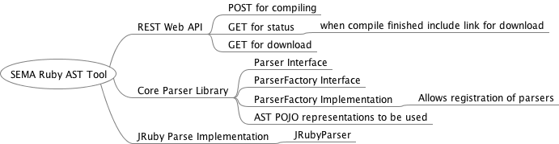

# SEMA Ruby Parser

## Architecture
In designing the architecture for this exercise, I considered several things.  First what was the core
or domain logic.  I see that as being able to parse Ruby and produce an Abstract Syntax Tree (AST).  Secondly is to
be able to do so for a folder of files.  Lastly is to be able to list and retrieve generated AST.

For the Web interface, I wanted it to be about interacting with the business logic, and not have it implemented there so 
it depends on the business logic, and uses it to do both the parsing, as well as retrieving generated AST.

Approaching the Ruby parsing, my immediate thought turned to JRuby as it is a very mature project
and already written in Java, supporting up to Ruby 2.5.  When looking at dependencies I consider:
their age, the community around them, stability, and license.  JRuby allows the parsing of Ruby files
into AST objects composing of the `Node` class, which has an `accept(NodeVisitor`) method.  My original
thought had been to map the `Node` objects to some sort of POJO objects and save those
as a JSON tree, but with the time constraints, saved the `toString()` of the root `Node` which shows the tree well,
though lacks some of the detail that would likely be necessary for a production system of analysis.

 

* Core Parser Library - interfaces and business logic classes go in here.
* JRuby Parser Implementation - parser implemented in JRuby.  
* REST Web API - Restful API using J2EE and Servlets to interact with core and JRuby libraries.

## Testing
For testing, all core classes and implementations have been thoroughly unit tested for functionality.  I would also usually
unit test the web layer, but due to using plain servlets, mocking out dependencies
to validate the code paths was difficult to do without arduous work.

In lieu of unit tests on the `web` project, there are some [Postman](https://www.getpostman.com/) integration tests that
can be found in the `SEMA.postman_collection.json` file in the root.  These
run through the functionality of kicking off a parsing / AST processing session,
getting a list of AST files, and viewing an individual AST file.

## Running
For the `web` project, I used the gradle `shadow` plugin in order to create a "fat" jar that can be run from the 
command line.  I also create a `run.sh` in the root of the project, that can be used to do the initial
build and then run the JAR file in order to use the tool.  In order to see how to call the various
web pages, you can import the `SEMA.postman_collection.json` as mentioned above.

## Improvements
* Improve Testability of `web` project - it would be better to use dependency injection here, and either
use a dependency injection framework, or use a framework like Spring MVC, which allows for better handling
of dependencies in web controllers.  This way the controller code could be more easily and elegantly unit
tested in order to provide better assurance of the code. 
* Produce a more robust Abstract Syntax Tree - this would require either mapping the JRuby AST to a different set
of objects, which could be done by inspecting the tree, or perhaps using Ruby itself to generate a better
representation.  To determine the best course of action, I would want to consider the application of
these files especially if used for analysis.  With 119 types of `Node`, creating a representation for each one would be rather
burdensome, so I would want to make a representation that focused on the needed application rather than
a full representation of the node objects.  Another option might be to not store the AST itself, but
to interact with it in order to produce the analysis and to store that.
* Web project improvements - I believe the ability to pass a local system folder was to simplify this exercise,
however in a production system, this would not be very useful unless the user had file access to the web 
server.  I would want a way for the user to upload something like a ZIP file or their code, or to point to
some sort of code repository that it could then be downloaded from.  I believe some persistence mechanism would
be useful, such as a database.  Then there could be the idea of a project, which had source files, and generated
AST files associate with it, and a way to look those up.
* Security - operating on a file system folder based on user input has inherent security risks, especially when
needing to write files.  Avoiding file system access, or sand-boxing this would help.  Also authenticating users with roles / permissions would 
need to happen to avoid potentially malicious activity in the application.
* Performance / Asynchronous Parsing - currently the parsing is done synchronously for the sake of simplicity.
For a large amount of code this would not be feasible, and would need to happen asynchronously.  To do this
I would want to store information about the parsing job, and allow the web interface to be able to poll the
status of the parsing.  A separate thread or ideally process would then be doing the parsing, and updating
that status as it did so.  Also a message queue / log could possibly be used here to make sure that all
items were parsed, and to coordinate which parsing jobs happened first.  Finally, parsing could be done
in a parallel way, so that multiple files could be parser at the same time.

## Notes from implementation / design.
I kept notes in Evernote while working.  I've included them here.
* Important Considerations
    * Parsing Ruby: First thought - how to parse Ruby into AST using Java.  Looking into JRuby / jruby-parser project for viability.  Another thought to compare to is ANTLR.  
        * Found that [https://github.com/jruby/jruby-parser](https://github.com/jruby/jruby-parser]) produces a representation of an AST as a result.  More research indicates this is a dead project.  Looking into using JRuby main project in order to parse Ruby files.
        * The main JRuby project Parser creates a set of nodes an an AST.  Saving as a reasonable file representation seems difficult.  toString is good, however not useful for re-use.
        * Ultimate design would probably use the JRuby main project, map the Nodes to a POJO, which could then be used for code evaluation or output to JSON format for later serialization.
        * Better design may be in pure Ruby running through JRuby.
* Setting up the Web Server:
    * Normally I would use Spring Boot, but due to simplicity of application using a simple J2EE app using embedded Tomcat for web server.  Referred to Oracle Documentation for basics of this: http://www.oracle.com/webfolder/technetwork/tutorials/obe/java/basic_app_embedded_tomcat/basic_app-tomcat-embedded.html
    * Found this to be more involved and poorly documented, went with simpler approach with Jetty.  https://www.eclipse.org/jetty/documentation/9.4.11.v20180605/embedding-jetty.html#_embedding_servlets
    * Used several StackOverflow / Blog Posts looking for how to do things I would commonly do using the Spring Framework, and found I had to do less elegant work arounds using vanilla Servlets.  There may be a more elegant way, but I didn’t find it.
    * I found many useful code examples (as I always do) at https://www.baeldung.com/
* Sample Ruby Code:
    * found some good samples here: https://github.com/khusnetdinov/ruby.fundamental
* Compromises for Time
    * Using vanilla J2EE and Embedded Jetty - had to use a Global object for a poor person’s Dependency Injection.  I prefer to have a better injection or Servlet Dependencies, but wanted to centralize the dependency creation.  Looking at a more full architecture, I would employ a better framework for creating Servlets or Controllers, Spring Boot / Spring MVC being options I prefer.
    * AST File creation - I would want to map the Nodes created as part of the AST in JRuby to POJO, to allow easy serialization / JSON file format.  Currently, using the JRuby `Node.toString()` to give a fair representation, though it is missing a lot of things.  

## Other Referenced Articles
* [Using Ruby parser and AST tree to find deprecated syntax](https://blog.arkency.com/using-ruby-parser-and-ast-tree-to-find-deprecated-syntax/)
* [Static Analysis in Ruby](http://www.rubyguides.com/2015/08/static-analysis-in-ruby/)
* [Parser](https://whitequark.github.io/parser/)
* [JRuby Scripting container using Gems wih a Maven Project](https://github.com/jruby/jruby/wiki/Jruby-Scripting-container-using-Gems-with-a-Maven-Project)
* [Build a single jar to house your entire ruby world](https://github.com/watkyn/jruby-gems-jar)
* [Programmatically extract a ZIP using Java](https://www.codejava.net/java-se/file-io/programmatically-extract-a-zip-file-using-java)
* [Stack Overflow - Root Servlet URL](https://stackoverflow.com/questions/1629102/root-url-of-the-servlet)
* [Baeldung - Creating Fat Jar in Gradle](https://www.baeldung.com/gradle-fat-jar)
* [Gradle Shadow Plugin Documentation](http://imperceptiblethoughts.com/shadow/)

